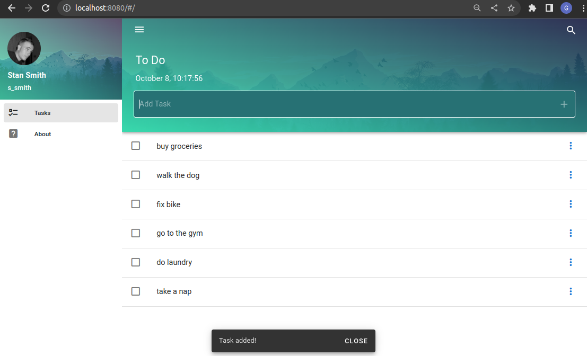
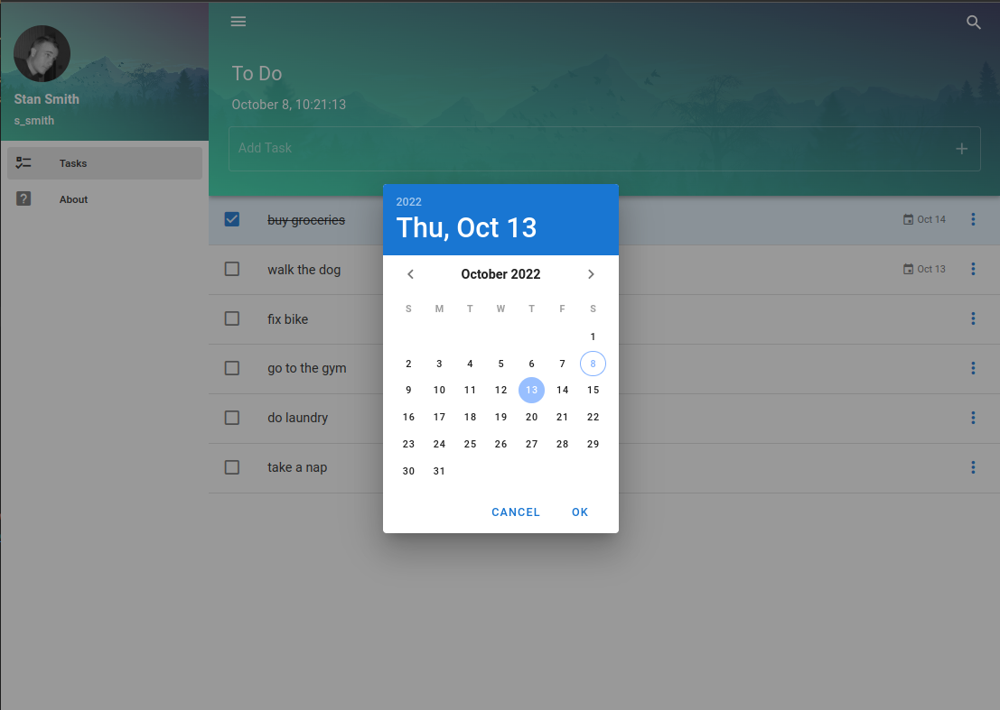

# vuetify-task

Application for task management. Built with Vue 2 and Vuetify.

<table align="center">
<tr>
<td align="center" width="9999">
<a align="center">


</a>
</td>
</tr>
</table>

## Project setup
```
npm install
```

### Compiles and hot-reloads for development
```
npm run serve
```

### Compiles and minifies for production
```
npm run build
```

### Customize configuration
See [Configuration Reference](https://cli.vuejs.org/config/).
